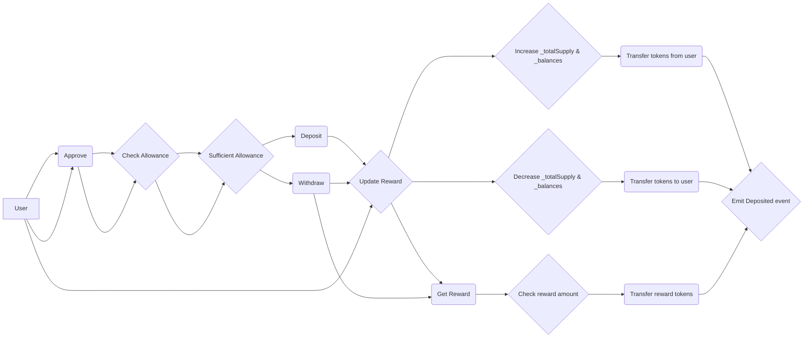

##  Installation
1. Install dependencies
```bash
nvm  use

npm  install
```

2. Update `.env` file
```bash
WALLET_KEY="<YOUR_PRIVATE_KEY>"

BASESCAN_API_KEY=<YOUR_BASE_SCAN_API_KEY>

ICY_CONTRACT=0xf289e3b222dd42b185b7e335fa3c5bd6d132441d
```

3. Deploy & verify factory contract
```bash
# deploy
npx  hardhat  ignition  deploy  ./ignition/modules/StakingPoolFactory.ts  --network  base-sepolia  --deployment-id  stakingpoolfactory

# verify
npx  hardhat  ignition  verify  stakingpoolfactory
```

##  Deploy a staking pool
- Go to `https://sepolia.basescan.org/address/<deployed_contract_address>#writeContract`
- Connect wallet & execute `deploy` method to deploy a new `StakingPool` with arguments:

   -  `stakingToken`

   -  `rewardToken`

  -  `rewardAmount` - Initial reward token amount transfered to pool

  -  `rewardTotalAmount` - Maximum reward token amount for pool


***Verify staking pool contract***

1. From source code, open json file located at `ignition/deployments/build-info` and copy value of `input` field to a new json file `example.json`

2. Go to `https://sepolia.basescan.org/address/<deployed_contract_address>#readContract`, execute method `stakingPoolInfoByStakingToken` with input `<staking_token_address>_<reward_token_address>` to get pool address

3. Finally, open `https://base-sepolia.blockscout.com/address/<pool_contract_address>?tab=contract` and upload the `example.json` file to verify pool contract.

## Documentation
### Pool Factory
This contract acts as a factory for deploying individual StakingPool contracts, allowing for the creation of multiple pools with different staking and reward token combinations. 

Here's a breakdown of its functionalities:
- `deploy`: To initiate a new `StakingPool` contract
	- Generates a unique key for the pool based on token addresses.
	- Creates a new StakingPool contract, specifying reward and staking tokens.
	- Stores pool information and the key in the StakingPoolFactory.
- `notifyRewardAmount`: This function, accessible only by the contract owner, allows transferring reward tokens to a specific deployed staking pool.
	- Calculates the remaining reward amount (total planned - already distributed).
	- Validates that the provided reward amount doesn't exceed the remaining amount.
	- Updates the  `rewardProgressAmount`  to reflect the transferred amount.
	- Calls the deployed StakingPool contract's  `notifyRewardAmount`  function to notify it about the received reward amount.
- `getStakingPoolKey`: This private helper function generates a unique key for a staking pool by combining the converted string representations of the staking and reward token addresses.

### Staking Pool
#### 1. Interaction Flow

#### 2. How Reward Rate is calculated
Here's a breakdown of how `rewardRate` it's determined:

**Condition:** The calculation depends on whether the current block timestamp (`block.timestamp`) has reached or surpassed the  `periodFinish`  (end of the current reward distribution period).

**Cases:**
 - New Reward Period (block.timestamp >= periodFinish):
	-   In this case, a new reward period starts. The  `rewardRate`  is simply calculated by dividing the provided total  `reward`  amount by the  `rewardsDuration`. This essentially determines the reward distributed per unit of time for the new period.
 - Existing Reward Period (block.timestamp < periodFinish):
	 - If there's still remaining time in the current reward period, a slightly more complex calculation is used:
	    -  The remaining time (`remaining`) is calculated as the difference between  `periodFinish`  and the current  `block.timestamp`.
		-   The "leftover" reward (`leftover`) is calculated by multiplying the  `remaining`  time by the current  `rewardRate`. This represents the undistributed reward amount from the previous period.
	    -   Finally, the  `rewardRate`  is updated by adding the provided  `reward`  and the  `leftover`  amount, then dividing by the  `rewardsDuration`. This effectively factors in any undistributed rewards from the previous period into the new  `rewardRate`  for the remaining time.

#### 3. Formula for calculating the current reward per staking token unit
> _**rewardPerToken = rewardPerTokenStored + [(lastTimeRewardApplicable - lastUpdateTime) * rewardRate * 1e18] / totalSupply**_

Explaination:
- `totalSupply`: Total of tokens are currently staked in the pool
- (`lastTimeRewardApplicable - lastUpdateTime`): The elapsed time since the last update
- `1e8`: The conversion factor for decimals
- `rewardPerTokenStored `: The previously stored value of `rewardPerToken`

##  Contributing
Pull requests are welcome. For major changes, please open an issue first
to discuss what you would like to change.
Please make sure to update tests as appropriate.

##  License
[MIT](https://choosealicense.com/licenses/mit/)